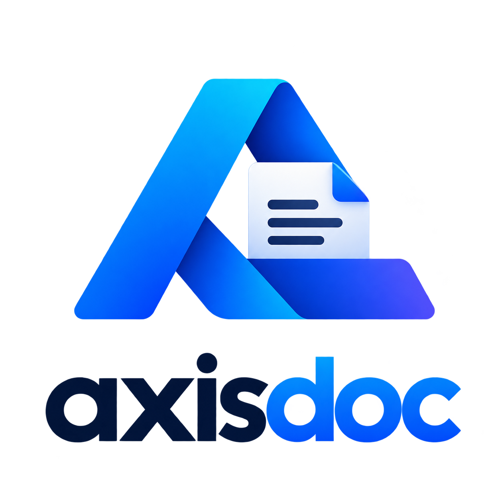

# AxisDoc

**Kit de ferramentas de escritório para desktop — 100% offline.**

Juntar PDFs, converter imagens, gerar QR codes, extrair texto, renomear em lote e muito mais — tudo local, sem conta, sem nuvem, sem telemetria. Seus arquivos nunca saem da sua máquina.

`Go` `Wails v2` `React` `TypeScript` `Tailwind CSS` `SQLite` `pdfcpu` `excelize`

---

## Sumário

- [Recursos](#recursos)
- [Instalação](#instalação)
- [Ferramentas](#ferramentas)
- [Arquitetura](#arquitetura)
- [Onde os dados ficam](#onde-os-dados-ficam)
- [Atalhos de teclado](#atalhos-de-teclado)
- [Estrutura do projeto](#estrutura-do-projeto)
- [Testes](#testes)
- [Roadmap](#roadmap)
- [Licença](#licença)

---

## Recursos

### PDF (23 ferramentas)

- **Juntar, dividir, extrair páginas, remover páginas, reordenar páginas** — manipulação completa de páginas
- **Comprimir, N-up (2/4/8 por folha), girar, marca d'água (texto ou imagem posicionada), sobrepor PDF**
- **Numerar páginas estilo livro** (número puro, sem marca d'água — define só o início e a posição)
- **Proteger com senha (AES) e desbloquear**, permissões, metadados XMP
- **Extrair**: texto, imagens, fontes, anexos, páginas — e **anexar arquivos** em PDFs
- **Criar PDF** (título + texto), **comparar PDFs**, **PDF para imagens** e **Imagens para PDF visual** (thumbnails com drag & drop para ordenar)
- **Editor visual de páginas**: thumbnails, remover, reordenar, girar 90° e inserir páginas em branco
- **Extrair páginas visual**: thumbnails selecionáveis (todas ou sob medida) convertidas em imagens PNG/JPG
- Visualizador embutido (PDF.js) com paginação e zoom

### Imagens (11 ferramentas)

- **Converter** entre JPG/PNG/GIF/BMP/TIFF, **redimensionar** com presets, **girar/inverter**
- **Filtros** (P&B, inverter, blur, nitidez, sépia, contraste, brilho) com **live preview**
- **Recortar visual** (desenhe/mova/redimensione o recorte sobre a imagem, com **preview do resultado antes de executar**, presets 1:1/4:3/16:9 e lote com o mesmo recorte)
- **Marca d'água** de texto (diagonal) ou imagem (5 posições + escala), **favicon .ico** multi-resolução
- **GIF**: extrair frames e montar animação a partir de PNGs, **paleta de cores**

### Dados (8 ferramentas)

- **CSV ↔ XLSX**, **comparar planilhas** célula a célula, **JSON ↔ YAML ↔ TOML**
- **Tabela ↔ JSON**, **JSON → tabela**, **CSV → SQL INSERTs** (SQLite/PostgreSQL/MySQL), **SQL → CSV**
- **Formatar/minificar JSON** com validação

### Texto e utilidades (13 ferramentas)

- **QR Code e código de barras** (CODE-128/EAN-13) com **preview ao vivo**
- **Diff de texto**, **renomear em lote** com regex (com desfazer), estatísticas de texto
- **Hash de arquivos** (MD5, SHA-1, SHA-256, SHA-512, CRC-32)
- Geradores: **Lorem ipsum, UUID v4/v7, slug, base numérica, timestamp/epoch, escape HTML/URL**

### Plataforma

- **Busca global** com índice FTS5 (texto de arquivos + PDFs), insensível a acentos, com prefixos
- **Macros**: encadeie ferramentas e execute em lote; **pastas vigiadas** disparam macros sozinhas
- **CLI embutida**: `axisdoc <tool-id> [arquivos]` — as mesmas ferramentas no terminal
- **OCR** de imagens via Tesseract (quando instalado)
- Fila de **jobs** com progresso, cancelamento e histórico persistente
- **Preview do resultado antes de executar** em todas as ferramentas visuais:
  - Imagens (girar, filtros, resize, convert, marcas d'água, crop visual): efeito aplicado na hora
  - PDF: página real + simulação (rotação, N-up, número, marca d'água, overlay, selo de proteção)
  - Comparador **antes × depois** com slider no resultado
- **Editor visual de PDF** (remover, reordenar, girar, inserir brancas), **crop visual de imagem com preview** (desenha/move/redimensiona) e **seleção visual de páginas** (extrair páginas como imagens, imagens para PDF com drag & drop)
- **Temas** Dark/Light, **3 idiomas** (PT-BR, EN, ES), **modo portable** (`--portable`)
- Verificação de atualização via GitHub Releases (silenciosa offline)

---

## Instalação

### Para usuários (sem compilar)

Baixe a versão mais recente na [página de Releases](https://github.com/fernando-ruans/AxisDoc/releases/latest):

| Arquivo | Descrição |
|---|---|
| `AxisDoc-amd64-installer.exe` | **Instalador** (recomendado) — atalhos, desinstalador e WebView2 Runtime embutido |
| `axisdoc.exe` | Portable — roda direto, sem instalação |

Requisitos: Windows 10 ou superior (x64). Para Linux, compile do código-fonte (dependências abaixo).

> ⚠️ O executável ainda não é assinado digitalmente — se o Windows SmartScreen exibir um aviso, clique em **Mais informações → Executar assim mesmo**.

### Para desenvolvedores

Pré-requisitos: **Go 1.25+**, **Node 20+**, **Wails CLI** (e [WebView2](https://developer.microsoft.com/microsoft-edge/webview2/) no Windows).

```bash
# clone e entre no projeto
git clone https://github.com/fernando-ruans/AxisDoc.git
cd AxisDoc

# instala o CLI do Wails (uma vez)
go install github.com/wailsapp/wails/v2/cmd/wails@latest

# instala as dependências do frontend
cd frontend && npm install && cd ..

# desenvolvimento com hot reload
wails dev

# build de produção (gera .exe + instalador NSIS se disponível)
wails build -nsis
```

O executável é gerado em `build/bin/`.

#### Linux

Dependências nativas: `libgtk-3-dev`, `libwebkit2gtk-4.1-dev` e `build-essential`.

```bash
sudo apt install libgtk-3-dev libwebkit2gtk-4.1-dev build-essential
wails build
```

#### Ícones

Para regenerar os ícones a partir de `logo.png`:

```bash
go run ./scripts/iconprep
```

Saídas: `frontend/public/logo.png` (cabeçalho), `build/appicon.png` (512px) e `build/windows/icon.ico` (multi-resolução).

---

## Ferramentas

São **59 ferramentas** organizadas por categoria na sidebar, todas com formulário próprio por intenção (transformar, gerar ou inspecionar), **preview do resultado antes de executar** e resultado inline com botões Abrir / Abrir pasta / Copiar caminho.

> **Filosofia de preview:** nada é gravado antes de confirmar. Ferramentas visuais mostram o efeito na hora (trocar a opção atualiza o preview); o botão Executar só então grava no destino escolhido.

Paleta de comandos com `Ctrl+K`, dashboard inicial com mais usadas e recentes, e CLI com os mesmos IDs:

```bash
# lista todas as ferramentas
axisdoc.exe tools

# exemplos
axisdoc.exe security.hashfile documento.pdf
axisdoc.exe pdf.merge --outputPath juntos.pdf a.pdf b.pdf
axisdoc.exe img.convert --format jpg foto.png
```

| Categoria | Ferramentas |
|---|---|
| PDF (23) | info, merge, split, rotate, watermark, compress, extracttext, extractimages, removepages, extractfonts, extractattachments, extractmetadata, permissions, diff, addattachments, fromimages, create, nup, rearrange, protect, unlock, overlay, pagenumbers (+ editor visual, extrair páginas visual e PDF→imagem) |
| Imagens (11) | convert, resize, watermark, watermarkpos, crop, transform, filters, icon, gifextract, gifbuild, palette |
| Dados (8) | tabular, xlsxdiff, struct, jsonformat, tablejson, csv2sql, sql2csv, json2table |
| Texto (12) | diff, rename, stats, qrcode, barcode, lorem, baseconvert, epoch, uuid, slug, columnize, escape |
| Segurança (1) | hashfile |
| Busca/OCR (2) | indexação FTS5, OCR via Tesseract |
| Macros/Watch | pipelines salvas + pastas vigiadas via UI e CLI (`axisdoc run <macro>`) |

---

## Arquitetura

```
┌─────────────────────────────────────────────────┐
│                  AxisDoc (Wails)                 │
│  ┌────────────────────┐   ┌───────────────────┐  │
│  │  React + TS UI     │◄──┤    Go Backend     │  │
│  │  (Tailwind,        │   │ (bindings: Tool/  │  │
│  │   Zustand, PDF.js) │   │ Job/System/Search/│  │
│  └────────────────────┘   │ Pipeline/Watch)   │  │
│                           └────────┬──────────┘  │
│                    ┌───────────────┼───────────┐ │
│               ┌────▼─────┐  ┌──────▼──┐  ┌─────▼─┐│
│               │  Tools   │  │  Jobs   │  │ Store ││
│               │ (60 pkgs)│  │ (fila)  │  │(SQLite││
│               └──────────┘  └─────────┘  └───────┘│
└─────────────────────────────────────────────────┘
```

| Camada | Tecnologia |
|---|---|
| Backend | Go 1.25+ com Wails v2 |
| Frontend | React 19 + TypeScript |
| Estilo | Tailwind CSS v4 |
| Estado | Zustand |
| PDF (visualização) | PDF.js (bundled, offline) |
| PDF (manipulação) | pdfcpu (+ fpdf p/ criação, ledongthuc/pdf p/ texto) |
| Planilhas | excelize |
| Banco | SQLite via modernc.org/sqlite (puro Go, sem CGO) |
| OCR | Tesseract local (opcional) |

Cada ferramenta implementa a interface `tool.Tool` (`ID/Category/Title/Description/Icon/Params/Steps`) e se registra no `Registry` central — o frontend renderiza o formulário a partir dos metadados, com layouts por intenção (Transform/Generator/Inspector/Editor).

---

## Onde os dados ficam

Banco SQLite com histórico de jobs, macros e configurações:

- **Windows**: `%APPDATA%\axisdoc\axisdoc.sqlite3`
- **Linux**: `~/.config/axisdoc/axisdoc.sqlite3`
- **Portable**: `axisdoc.exe --portable` grava ao lado do executável
- Override para testes/dev: variável `AXISDOC_DATA_DIR`

---

## Atalhos de teclado

| Atalho | Ação |
|---|---|
| `Ctrl+K` | Paleta de comandos (ferramentas + navegação) |
| `←` / `→` | Navegar páginas no visualizador de PDF |
| `Esc` | Fechar paleta |

---

## Estrutura do projeto

```
.
├── app.go / main.go / services.go / pdfedit.go  # app Wails, bindings e serviços
├── internal/
│   ├── tool/            # interface Tool/Step, Registry, Param (contrato UI)
│   ├── tool/pdftools*   # 24 ferramentas de PDF (3 pacotes)
│   ├── tool/imgtools*   # 11 ferramentas de imagem (2 pacotes)
│   ├── tool/datafiles*  # 8 ferramentas de dados (2 pacotes)
│   ├── tool/texttools*  # 12 ferramentas de texto (2 pacotes)
│   ├── jobs/            # fila de execução, progresso, cancelamento
│   ├── store/           # SQLite: jobs, settings, backups
│   ├── watcher/         # pastas vigiadas (backend)
│   ├── pipeline/        # macros persistidas
│   ├── watcher/         # pastas vigiadas (fsnotify)
│   ├── cli/             # modo linha de comando
│   ├── ocr/             # OCR via Tesseract local
│   ├── update/          # verificação via GitHub Releases
│   └── output/          # escrita atômica de arquivos
├── frontend/src/
│   ├── components/      # layouts, fields, páginas, editor PDF, preview
│   ├── bindings/        # contrato backend (real + mock p/ testes)
│   ├── i18n/            # PT-BR, EN, ES
│   └── test/            # catálogo canônico + goldens por tool
├── scripts/             # iconprep, coverage-gate, sync-snapshot
├── testdata/            # snapshot do catálogo (trava anti-drift)
└── wails.json           # configuração do Wails
```

---

## Testes

```bash
go test ./...            # Go: 25 pacotes (unit + integração + golden)
go run ./scripts/coverage-gate <coverage.out> 70
cd frontend && npm test  # Vitest + Testing Library (golden por tool, 105 testes)
npm run e2e              # Playwright (mock) + smoke contra wails dev real
```

Pirâmide completa: testes de contrato do catálogo (fail-fast no `Register`), snapshot do `ListTools` real vs mirror TS (`testdata/catalog.snapshot.json` + `scripts/sync-snapshot.cjs` — qualquer drift quebra o build de teste), goldens por ferramenta, i18n validado nos 3 idiomas e E2E por família de ferramenta.

---

## Roadmap

**Concluído:**

- ✅ Fundação — registry de tools, jobs, SQLite, UI, CI, CLI
- ✅ 59 ferramentas (PDF, imagens, dados, texto, segurança) + editor visual de PDF
- ✅ Busca global FTS5, macros, pastas vigiadas, OCR, live preview, PDF→imagem
- ✅ Preview do resultado antes de executar (imagem + PDF com simulação visual)
- ✅ i18n PT-BR/EN/ES, temas, instalador NSIS, modo portable

**Futuro:**

- Assinatura de código (certificado) para eliminar o aviso do SmartScreen
- Rasterização de PDF no backend (pdfium — hoje via PDF.js no frontend)
- Assinatura digital e censura (redact) de PDFs
- Auto-update automático (hoje só badge de aviso)
- OCR de PDF escaneado fim a fim

---

## Licença

Distribuído sob a licença **MIT** — veja [LICENSE](https://github.com/fernando-ruans/AxisDoc/blob/master/LICENSE).

---

Feito com 🧠, 📄 e Go.
